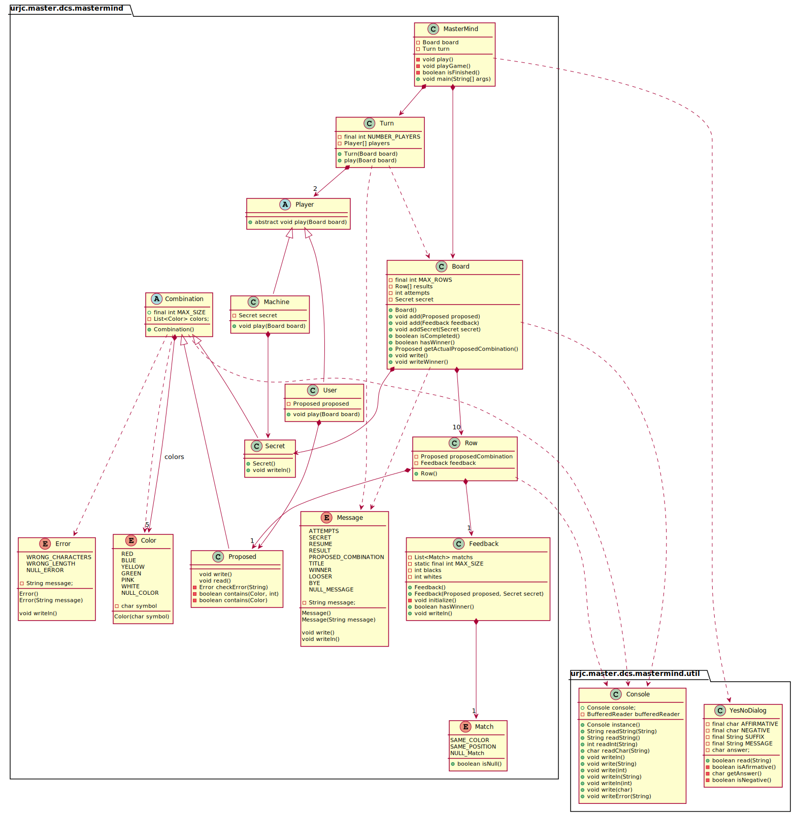

<!DOCTYPE html>
<html lang="en">
<head>
  <title>Bootstrap Example</title>
  <meta charset="utf-8">
  <meta name="viewport" content="width=device-width, initial-scale=1">
  <link rel="stylesheet" href="https://maxcdn.bootstrapcdn.com/bootstrap/3.4.1/css/bootstrap.min.css">
  
  
</head>
<body>

  <h2 id="modelo-del-dominio">Modelo del Dominio</h2>
  <li><a href="#vocabulario">Vocabulario</a></li>
  

    
  

</body>
</html>
